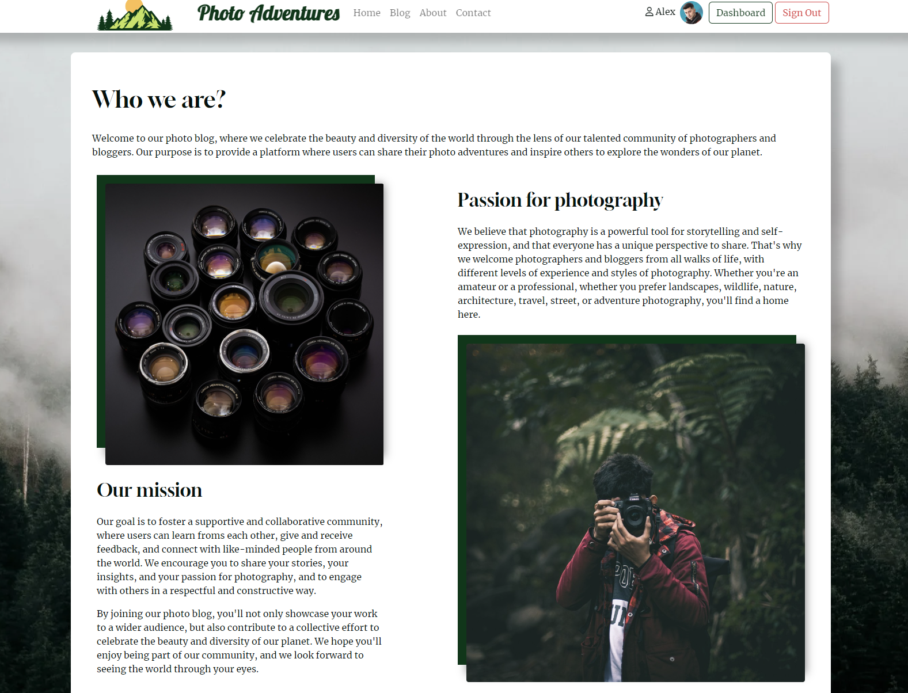
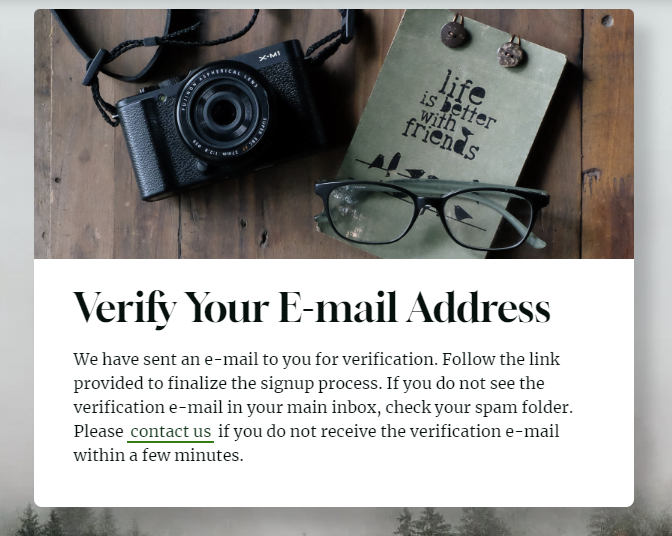

<h1 align="center">Photo Adventures Website</h1>
<h3 align="center">Full-Stack Toolkit Project</h3>

### Developer: Aleksander Kisielewicz

<b>[View live website here](https://photo-adventures.herokuapp.com/)</b> :computer:

Photo Adventures Website was created as Portfolio Project #4 (Full-Stack Toolkit) for Diploma in Full Stack Software Development at [Code Institute](https://www.codeinstitute.net).

Project purpose was to build a full-stack site using agile methodology to plan and design web application using MVC framework and related contemporary technologies. Appplication offers users full CRUD (create, read, update, delete) functionality.

Application offers such functionalities as:

- **Secure user registration** Users can register with captcha protection and e-mail verification
- **Password reset via email** Users can easily reset their forgotten password with just a few clicks
- **Sign in/out** Users can conveniently sign in and out of their account
- **Role-based access** Access to functionalities is granted based on the user's assigned role
- **User dashboard** Users can view their own personalized dashboard, complete with user content
- **Post management** Users can view, add, edit, and delete their posts with ease (CRUD)
- **Saving drafts and publishing** Users can save their edited posts as drafts or publish them (send to modaration)
- **Moderation** Admins can moderate posts and comments
- **Commenting** Users can leave comments on posts and have their Gravatar user picture displayed
- **Liking** Users can add likes to posts to show their appreciation
- **Messages/feedbac** Users receive feedback and confirmation to their actions
- **Social media sharing:** Posts can be easily shared on Facebook and Twitter
- **Contact form:** Users can send messages to the admin through a contact form that includes captcha protection

# Table of content

-   [Project](#project)
    *   [Strategy/Scope](#strategyscope)
    *   [Agile Methodology for project planning](#agile-methodology-for-project-planning)
    *   [Site owner goals](#site-owner-goals)
    *   [External user's goal](#external-users-goal)
    *   [Wireframes](#wireframes)
*   [User Experience (UX/UI)](#user-experience-ux)
    *   [Colour Scheme](#colour-scheme)
    *   [Typography](#typography)
*   [Logic and features](#logic-and-features)
    *   [Python logic](#python-logic)
    *   [Database structure](#database-structure)
    *   [Features](#features)
        *   [Navbar and menu](#navbar-and-main-menu)
        *   [Footer](#footer)
        *   [Carousel](#index-page--carousel)
        *   [Blog](#blog)
        *   [Full Post View](#full-post)
        *   [About Page](#about-page)
        *   [Contact Page](#contact-page)
        *   [Admin Panel](#admin-panel)
        *   [User Dashboard](#user-dashboard)
        *   [Accounts](#accounts-templates)
*   [Technology](#technology)
    *   [Software used](#software-used)
    *   [Python libraries/modules](#python-librariesmodules)
*   [Testing](#testing)
    *   [Accessibility](#accessibility)
    *   [Validation](#validation)
    *   [Manual testing](#manual-testing)
    *   [Bugs/known issues](#bugsknown-issues)
*   [Deployment](#deployment)
    *   [Git and GitHub](#git-and-github)
    *   [Deployment to Heroku](#deployment-to-heroku)
*   [Possible future development](#possible-future-development)
*   [Credits](#credits)
    *   [Code](#code)
    *   [Media](#media)
    *   [Acknowledgements](#acknowledgements)

#   Project
##  Strategy/Scope

I chose to develop an web application that can be used in real life. My main focus was always on providing an excellent user experience, which is why I decided to create a web application that is both practical and engaging. Photo Adventures is a user-friendly blog-style website where users can share their photo adventures by creating visually appealing blog posts that include both images and text.
Application should have clean and intuitive user interface and offer easy access and navigation to all functionalities. Application should also be responsive on devices of all screen sizes.

To achieve the strategy goals I implemented following features:

- a clean and intuitive user interface for ease of navigation and readability,
- a menu that provides easy access to all website sections, including personalized content via user dashboard,
- cloud hosting of images for optimized website speed and user experience,
- media queries to ensure responsiveness across all types of devices,
- feedback to users for all actions taken on the website.

## Agile Methodology for project planning

## Site owner goals

- #2 As Site Admin, I can log in to admin panel so that I can manage posts
- #3 As Site Admin, I can perform CRUD operations on posts so that I can manage the content on the blog
- #6 As Site Admin, I can view the number of likes on posts so that I can see which is the most popular
- #7 As Site Admin, I can view comments on posts so that I can read the conversation
- #11 As Site Admin, I can approve/delete users comments so that I can moderate inappropriate ones
- #13 As Site Admin, I can add posts in categories so that I can group photos by this criteria
- #14 As Site Admin, I can add tags to the posts so that others can easily find posts related to specific topics
- #23 As Site Admin, I can prevent users from liking their own posts so that posts can be liked only by other users
- #30 As Site Admin, I want to allow users to have a profile image displayed alongside their comments on the blog so it's easier for readers to identify who is commenting
- #31 As Site Admin, I want to present the user with a custom 404 page if he navigates to a page that doesn't exist so that he can see a user-friendly message that offers some guidance or suggestions
- #33 As Site Admin, I want to ensure that only human users can submit the contact form so that I can prevent spam or bot submissions
- #38 As Site Admin, I want to display success, error, and warning messages to my users using Bootstrap toasts so that they always receive easy-to-understand feedback regarding their actions
- #39 As Site Admin, I want to validate inputs in add/edit post forms so that I can have control on what input values are allowed
- #41 As Site Admin, I can distinguish specific post as featured post so that I can direct user's attention to that post

## External user's goal

- #1 As Site User, I can view a list of all posts so that I can select one to read
- #4 As Site User, I want to be able to create an account on the blog so that I can add posts, comments, and likes
- #5 As Site User, I can select a post so that I can read it
- #6 As Site User, I can view the number of likes on posts so that I can see which is the most popular
- #7 As Site User, I can view comments on posts so that I can read the conversation
- #8 As Site User, I can write comments on posts so that I can be the part of the conversation
- #9 As Site User, I can like/unlike posts so that I can give feedback in form of likes
- #10 As Site User, I can create draft posts so that I can finish publishing later
- #12 As Site User, I can create blog posts with photos and text so that I can share my photography adventures
- #13 As Site User, I can add posts in categories so that I can group photos by this criteria
- #14 As Site User, I can add tags to the posts so that others can easily find posts related to specific topics
- #15 As Site User, I can edit an delete my posts so that I can update them or remove if necessary
- #16 As Site User, I can use the contact form so that I can contact the website owner if needed
- #17 As Site User, I can view page content so that I can browse the website and interact with the content
- #19 As Site User, I can see the posts with the highest number of likes so that I know which posts are the most popular
- #20 As Site user, I can see my account page so that I can manage my posts
- #21 As Site User, I can view all posts added by me so that I keep track of my blogging activity
- #25 As Site User, I can view my drafts in my dashboard so that I can select them and continue editing
- #26 As Site user, I can click on the edit button in full post view so that I can edit post quickly without the need of searching for the post in the dashboard
- #29 As Site User, I can get recommendations to read similar posts on the blog so that I can read stories that are in my interest range
- #35 As Site User, I can view a list of all posts written in specific category so that I can read the posts from categories that I am interested in
- #37 As Site User, I can share interesting posts on popular social media platforms so that my friends can learn about posts that I enjoyed reading
- #40 As Site User, I can check image dimensions, format, and file size before user upload new image so that I have full control on what files are uploaded to the cloud

## Wireframes

[Wireframes - PDF File](docs/photo_adventures_wireframes.pdf)

Index - main page

Blog

Single full post

About

Contact

All accounts pages

#   User Experience (UX)

##  Colour Scheme

Colour palette was selected using <b>coolors.co</b> generator.

I created CSS classes and assigned them roles (examples):

- #04100D "dark" - main text, headers, post titles
- #003718 "green" - links inside paragraphs (text and hover outline), social icons, accordion buttonsm, buttons
- #CDCECF "silver" - post tags bacground
- #C9E365 "accent-green" - edit post icon (hover)
- #FFBD59 "accent-orange" - links (hover), social icons (hover), navigation items (hover), user dashboard background

## Typography

The [Merriweather](https://fonts.google.com/specimen/Merriweather) font is the main font used throughout the whole website with Sans Serif as the fallback. Merriweather is a clean, modern looking and well known font. It is sourced from Google fonts and it's linked to css document via @import method.

The [Gloock](https://fonts.google.com/specimen/Gloock) is a contemporary high-contrast serif typeface intended for display use. It draws inspiration from newspaper's headlines but with a contemporary approach. I used this font to use for headings and post titles. Serif font is set as fallback.

[Lobster](https://fonts.google.com/specimen/Lobster) font is used as Photo Adventures text logo, cursive font is set as fallback.

# Logic and features

## Python Logic

## Database structure

## Features

### Navbar and main menu

Bootstrap navbar component was used to create navigation bar. It is always visible and stays fixed at the top of the screen. Navbar consists of image logo, text logo and links to main areas of the site (home, blog, about and contact pages). There is also place for Sign up and Sign in buttons which are displayed to unauthenticated user.

Nabar displayed to authenticated user includes user name, gravatar and button link leading to user dashboard.

Navbar displayed to staff/admin user includes button with link leading to admin panel (accounts).

Mobile navbar for medium screen devices with hamburger menu button and collapsible menu.

Mobile navbar for small screen devices, without image logo to save screen space.

### Footer

The footer consists of 3 columns. The first column contains copyright info and address. The second one has quick navigation links for easy navigation. The third one includes site logo and social media links with icons, allowing visitors to connect with the brand on popular social media platforms.

On small devices all elements are centered in one column that takes all width of the screen.

### Index page / Carousel

User is welcomed with image slideshow with pictures related to such categories as Landscape, Nature, Architecture and Travel. Bootstrap carousel component was used to showcase different types of pictures and provide users with a visually engaging and dynamic experience. Slideshow has automatic transition but users can take control of the slides using "previous" and "next" buttons. Each slide picture has header and short slogan description located in overlay. Carousel takes all viewport width and height on big screens and is reduced on small devices that are usually used in portrait mode.

Hero section is designed to catch visitor's attention and provide them basic introduction to site content and purpose. Hero section consists of two columns, one with text and second with image. Unauthorised users can see "Sign up" and "Visit blog" call-to-action buttons. Authenticated user can see "Add post" and "Visit blog" buttons instead.  

Below hero section there are animated counters that present "page in numbers" statistics.
They show total number of posts, comments, reactions and registered users.

Most liked posts is a section that presents three posts with highest numer of "likes". Posts are displayed as bootstrap cards, they include links to full articles.

### Blog

Blog page is a list of all posts. Each post is presented as bootstrap card that includes featured image (or default placeholder if picture is not provided by user), post title, brief excerpt. In addition to this elements user can also find post details such as its location, author, creation date and number of likes and comments. The posts are paginated by 5 articles per page.

It is possible to browse posts by tags.

### Full Post

When viewing a post in full, users will see either a featured image or a placeholder if the author hasn't provided one. As on the blog page, the post title and other details are displayed beneath the image. On the left side of the picture, an overlay shows the location information. In the top right corner, users will find a like button. Only authenticated users can like posts, and if the user is also the author of the post, they will see an edit button below the like button. In the bottom right corner of the picture, there are social media sharing buttons, allowing users to easily share the post on Facebook or Twitter.

In the full post view, users can also see post tags, which can be clicked to bring the user to a list of related posts. This feature helps readers discover other content on the same topic and explore related ideas.

Beneath the main content of the article, you'll find a comment section. On the left-hand side of the page, all comments are displayed, along with the author's Gravatar, username, and date of the comment. For users who do not have a Gravatar account, a placeholder image will be displayed instead. This ensures that all comments are visually consistent.
To post a comment, users must be authenticated and can use the form provided in the right-hand column. A link to guidelines and posting rules is also included to ensure that all comments are respectful and related to topic.

### About Page

The About page is divided into three paragraphs. The first paragraph introduces who we are as a group, while the second highlights passion for photography. The third paragraph outlines the mission and what we hope to achieve. Images are included within the text to visually enhance the content.

At the bottom of the page, a bootstrap accordion houses a FAQ section. The answers to common questions are provided in a concise format, making it easy for users to quickly find the information they need.

### Contact Page

The Contact page is designed with a two-column layout, featuring the contact form on the left and the location, address, and Google Maps on the right. Users can use the contact form to get in touch with the site admin directly. To facilitate sending emails through client-side technologies, the Email.js library has been integrated. The form allows users to fill in their name, email address, and message, and authenticated users can have their name and email fields pre-filled for convenience.

To prevent spam, a [Google reCAPTCHA v2](https://developers.google.com/recaptcha/docs/display) widget has been implemented.

On the right-hand side, the location, address, and Google Maps provide users with a visual representation of where we are located and make it easy for them to find us.

### Admin Panel

The admin panel provides access to various details related to blog posts, including the post title, slug, author, category, tags, status, and creation date. These details make it easy for the admin to manage and organize posts effectively. There is also existing "featured" field in the model, this functionality was left as potential future enhancement and has been described in project's user stories.

In addition, actions have been registered that allow the admin to select multiple posts and change their status in one click. This feature saves time and helps to manage larger number of posts.

Also a list of filters have been registered in the admin view, admin can sort and display posts by author, status, etc.

### User Dashboard

The page displays a dashboard for the user with basic statistics about their blog posts and gives user the ability to manage them (full CRUD functionality). The user's gravatar is displayed in the top left of the page, along with a welcome message that greets the user by name. In this section user can also find "Add post" button to click and start writing new post. The form of keypoints inform users that they can manage their content from the dashboard and can view their post history and monitor engagement such as likes and comments.

Three sections below show all posts written by user in a form of bootstrap cards. They are divideded into tabs: drafts, awaiting moderation and published posts. The sections stay hidden until there is related content to be presented. Each card can be clicked and overlay contains relevant control buttons allowing viewing, editing or deleteing posts.

Form of defensive development, post deletion confirmation screen.

### Accounts Templates

#   Technology
    
##  Languages used

-   [HTML5](https://en.wikipedia.org/wiki/HTML5) - markup language used for structuring webpage content
-   [CSS3](https://en.wikipedia.org/wiki/CSS) - stylesheet language
-   [JavaScript](https://en.wikipedia.org/wiki/JavaScript) - high-level, imperative, programming language.
-   [Python](https://www.python.org/) - high-level, imperative, general-purpose programming language.
-   [Markdown](https://en.wikipedia.org/wiki/Markdown) - markup language used to write README and TESTING documents.

##  Software used
- [Bootstrap5](https://blog.getbootstrap.com/2022/11/22/bootstrap-5-2-3/) - CSS framework developed by Twitter. 
- [Cloudinary](https://cloudinary.com/) - cloude-based image and video API
- [Django](https://www.djangoproject.com/) - python-based web framework with MTV architectural pattern.
- [Jinja](https://en.wikipedia.org/wiki/Jinja_(template_engine)) - web template engine for python/django apps
- [Coolors.co](https://coolors.co/) - was used to create colour palette for terminal display page.
- [Favicon.io](https://www.favicon.io) - tool used to create favicon.
- [Font Awesome:](https://fontawesome.com/) - Font Awesome icons were used for social links in terminal display page.
- [Git](https://git-scm.com/) - Git was used for version control by utilizing the Gitpod terminal to commit to Git and Push to GitHub.
- [GitHub](https://github.com/) - GitHub is used to store the project's code after being pushed from Git.
- [Heroku](https://heroku.com) - online app used to deploy project.
- [Pexels.com](https://www.pexels.com/) - was used to source bacground picture for terminal display page.
- [WebAIM](https://webaim.org/resources/contrastchecker/) - online tool to check colour contrast/accesibility.
- [Gravatar](https://en.gravatar.com/)
- [EmailJS](https://www.emailjs.com/) - JavaScript library used to send emails usung only client-side technologies.
- [GoogleMaps](https://www.google.com/maps)
- [GooglereCaptchav2](https://developers.google.com/recaptcha/docs/display?hl=en)
- [Gmail](https://mail.google.com/)
- [Canva](https://www.canva.com/) - used to design logo picture
- [Convertio.io](https://convertio.co/) - used to convert images to webp format

##  Python libraries/modules

- [os](https://docs.python.org/3/library/os.html) - built-in pythod module - used to save and import env variables.
- [cloudinary](https://pypi.org/project/cloudinary/)
- [CrispyBootstrap5](https://pypi.org/project/crispy-bootstrap5/)
- [dj-database-url](https://pypi.org/project/dj-database-url/0.5.0/)
- [dj3-cloudinary-storage](https://pypi.org/project/dj3-cloudinary-storage/)
- [django-allauth==0.52.0](https://pypi.org/project/django-allauth/) - integrated django accounts management
- [django-crispy-forms](https://pypi.org/project/django-crispy-forms/)
- [django-social-share](https://pypi.org/project/django-social-share/) - used for facebook and twitter share buttons
- [django-summernote](https://pypi.org/project/django-summernote/) - WYSIWYG editor widget used for writing/editing post content 
- [django-taggit](https://pypi.org/project/django-taggit/) - used for post categorizing by tag name
- [gunicorn](https://pypi.org/project/gunicorn/) - python WSGI HTTP Server for UNIX
- [oauthlib](https://pypi.org/project/oauthlib/) - 
- [psycopg2](https://pypi.org/project/psycopg2/) - 
- [PyJWT](https://pypi.org/project/PyJWT/)
- [pytz](https://pypi.org/project/pytz/) 
- [requests-oauthlib](https://pypi.org/project/requests-oauthlib/) - OAuth library suppor for python requests
- [sqlparse](https://pypi.org/project/sqlparse/) - non-validating SQL parser for Python. It provides support for parsing, splitting and formatting SQL statements.

#    Testing

##   Accessibility

[WebAIM](https://webaim.org/resources/contrastchecker/) online tool was used to check terminal colour contrast. All used colours passsed the test satisfactory.

## Validation

### PEP8

## Manual testing

Details of manual testing can be found in [TESTING.md file](link)

##   Bugs/known issues

- <b>Issue #1:</b> 

- <b>Solution:</b> Putting "break" instruction in the correct place, that allows to "escape" from the while loop.

- <b>Issue #2:</b> 

- <b>Solution:</b> 

#   Deployment

## Git and GitHub

## Deployment to Heroku

1. I visited [https://heroku.com/](https://heroku.com/) and opened dashboard. Then I clicked button "New" and selected "Create new app" button.

2. I entered my app name as "photo-adventures", chose region to Europe and clicked on "Create app" button

3. The next step was to go to "Deploy" tab and then to "Deployment method" section to authorize and connect my GitHub account.

4. Upon succesfull connection I selected main branch from "photo-adventures" repository.

5. Then I went to "Settings" tab...

6. In the next step I went to "Config Vars" section and added KEY "CREDS" - that maches my token name defined in python constant in [api/google_sheets_api.py](https://github.com/alexkisielewicz/home-library-app/blob/main/api/google_sheets_api.py) - with value of my credentials token (copy all and paste).

7. I added key "PORT" with value "8080" and save changes.

8. In the next step I went back to "Deploy" tab and decided to use automatic deploys, however manual mode is also available to deploy chosen branch.

9. The link to my deployed app was shown on screen: [https://photo-adventures.herokuapp.com/](https://photo-adventures.herokuapp.com/)

 

# Possible future development

If I had more time or decide to develop app further I would add/improve following functionalities: 

#   Credits

##  Code

##  Media

- [Photos Pawel Zygmunt](https://www.breakinglightpictures.com/) - thanks to my friend Pawel for 3 photos from Tenerife, Connemara and Dolomites.  
- [Alek Kisielewicz Photography](https://www.facebook.com/alex.perfect.photo) - all other post images are my own photographs.

- [Pexels.com](https://www.pexels.com) - post placeholder image/background image/accounts background

## Learning resources

- [Code Institute course and learning platform](https://codeinstitute.net/)
- [The book "Python Crash Course, 2nd Edition: A Hands-On, Project-Based Introduction To Programming"](https://nostarch.com/pythoncrashcourse2e)
- [StackOverflow](https://stackoverflow.com/)
- [W3Schools](https://www.w3schools.com/python/default.asp)
- [Django](https://www.djangoproject.com/) - Django documentation.
- [Bootstrap](https://blog.getbootstrap.com/2022/11/22/bootstrap-5-2-3/) - Bootstrap documentation.
- Documentation of python modules and libraries used in the project.

##  Acknowledgements

-   My Mentor Reuben Ferrante for helpful feedback and guidance at all stages of the project.
-   Code Institute Slack Community for being invaluable knowledge base.

## Disclaimer
-   Photo Adventures Website was created for educational purpose only. 