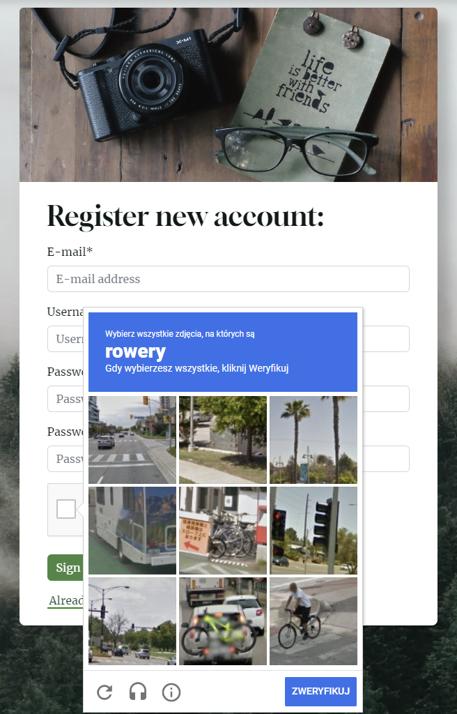

<h1 align="center">Photo Adventures Website</h1>

<h3 align="center">Full-Stack Toolkit Project</h3>
<h4 align="center">(HTML5 CSS3, Bootstrap, Django, Python, JavaScript, PostgreSQL, Cloudinary)</h4>

### Developer: Aleksander Kisielewicz

**[View live website here](https://photo-adventures.herokuapp.com/)** :computer:


Photo Adventures Website was created as Portfolio Project #4 (Full-Stack Toolkit) for Diploma in Full Stack Software Development at [Code Institute](https://www.codeinstitute.net).

Project purpose was to build a full-stack site using agile methodology to plan and design web application using MVC framework and related contemporary technologies. Appplication offers users full CRUD (create, read, update, delete) functionality.

Application offers such functionalities as:

- **Secure user registration** - Users can register with captcha protection and e-mail verification
- **Password reset via email** - Users can easily reset their forgotten password with just a few clicks
- **Sign in/out** - Users can conveniently sign in and out of their account
- **Role-based access** - Access to functionalities is granted based on the user's assigned role
- **User dashboard** - Users can view their own personalized dashboard, complete with user content
- **Post management** - Users can view, add, edit, and delete their posts with ease (CRUD)
- **Saving drafts and publishing** - Users can save their edited posts as drafts or publish them (send to modaration)
- **Moderation** - Admins can moderate posts and comments
- **Commenting** - Users can leave comments on posts and have their Gravatar user picture displayed
- **Liking** - Users can add likes to posts to show their appreciation
- **Messages/feedback** - Users receive feedback and confirmation to their actions
- **Social media sharing:** - Posts can be easily shared on Facebook and Twitter
- **Contact form:** - Users can send messages to the admin through a contact form that includes captcha protection

# Table of content

- [Project](#project)
  - [Strategy/Scope](#strategyscope)
  - [Agile Methodology for project planning](#agile-methodology-for-project-planning)
  - [Site owner goals](#site-owner-goals)
  - [External user's goal](#external-users-goal)
  - [Wireframes](#wireframes)
- [User Experience (UX/UI)](#user-experience-ux)
  - [Colour Scheme](#colour-scheme)
  - [Typography](#typography)
- [Logic and features](#logic-and-features)
  - [Database model and database structure](#data-model-ad-database-structure)
  - [Features](#features)
    - [Navbar and menu](#navbar-and-main-menu)
    - [Footer](#footer)
    - [Home page - carousel](#home-page---carousel)
    - [Home page - hero](#home-page---hero)
    - [Home page - counters](#home-page---counters)
    - [Home page - most liked posts](#home-page---most-liked-posts)
    - [Blog](#blog)
    - [Full Post View](#full-post)
    - [About Page](#about-page)
    - [Contact Page](#contact-page)
    - [Admin Panel](#admin-panel)
    - [User Dashboard](#user-dashboard)
    - [Accounts](#accounts-templates)
    - [Add/edit post](#addedit-post)
    - [Messages](#messages)
- [Technology](#technology)
  - [Software used](#software-used)
  - [Python libraries/modules](#python-librariesmodules)
- [Testing](#testing)
  - [Manual testing](#manual-testing)
  - [Bugs/known issues](#bugsknown-issues)
- [Deployment](#deployment)
  - [Database](#database-elephangsql)
  - [Cloudinary](#cloudinary)
  - [Django secret key](#django-secret-key)
  - [Gmail SMTP](#gmail-smtp)
  - [Github and Gitpod](#github-and-gitpod)
  - [Heroku](#heroku)
- [Possible future development](#possible-future-development)
- [Credits](#credits)
  - [Code](#code)
  - [Media](#media)
  - [Acknowledgements](#acknowledgements)

# Project

## Strategy/Scope

I chose to develop an web application that can be used in real life. My main focus was always on providing an excellent user experience, which is why I decided to create a web application that is both practical and engaging. Photo Adventures is a user-friendly blog-style website where users can share their photo adventures by creating visually appealing blog posts that include both images and text.
Application should have clean and intuitive user interface and offer easy access and navigation to all functionalities. Application should also be responsive on devices of all screen sizes.

The website's target audience is anyone who is passionate about photography and enjoys sharing their experiences and stories through pictures. It is inclusive of both amateur and professional photographers who are looking for a platform to showcase their work and connect with like-minded individuals. Whether it's capturing stunning landscapes, wildlife images, or simply capturing moments of everyday life, Photo Adventures Website welcomes anyone who wants to share their love of photography with the world.

To achieve the strategy goals I implemented following features:

- a clean and intuitive user interface for ease of navigation and readability,
- a menu that provides easy access to all website sections, including personalized content via user dashboard,
- cloud hosting of images for optimized website speed and user experience,
- media queries to ensure responsiveness across all types of devices,
- feedback messages to users for all important actions taken on the website.

## Agile Methodology for project planning

I used agile methodology for the first time when planning full-stack django website with a focus on delivering the basic functionalities. I prioritized features by labeling them as "must-have" or "could-have" and moved some less critical ones to future development. To guide my development process, I created user stories for both the admin user and regular visitors. These stories helped to define the features and functionalities that were most important to project's target audience.

As a solo developer who was learning a lot during development, I faced challenges in estimating the time required for each task and only had a basic concept of what I would create. Therefore, I kept things simple and focused on achievable goals. As the project grew, I was able to add more advanced features and group user stories into milestones. However, I could not find the "epics" feature in GitHub Projects, only milestones (it provides only [milestones and issues](https://docs.github.com/en/issues/tracking-your-work-with-issues/about-issues)). Epics are supposed to be larger in scope than milestones, representing a significant amount of work. Milestones, on the other hand, are meant to mark significant points in time in terms of project completion. In this document, I added epics, but on the project board, I used only [milestones](https://github.com/alexkisielewicz/photo-adventures/milestones) to stay in order with GitHub's features.

To keep track of progress, I used a kanban board divided into following sections: "to do", "in progress" "done", "future enhancements" and "bugs" that allowed to visualize all tasks and prioritize next steps.

By using agile methodology, I was able to stay organized and focused on delivering the most important features, while also allowing flexibility for future development. This experience gave me valuable insight and lessons that I can apply to future projects.


| Epic | Milestone | User stories |
|------|-----------|--------------|
| Epic 1: Basic Site Functionality | Milestone 1: Authentication | [#2](https://github.com/alexkisielewicz/photo-adventures/issues/2), [#4](https://github.com/alexkisielewicz/photo-adventures/issues/4) |
|  | Milestone 2: View and select posts | [#1](https://github.com/alexkisielewicz/photo-adventures/issues/1), [#5](https://github.com/alexkisielewicz/photo-adventures/issues/5), [#17](https://github.com/alexkisielewicz/photo-adventures/issues/17) |
|  | Milestone 3: Post CRUD operations  | [#3](https://github.com/alexkisielewicz/photo-adventures/issues/3), [#10](https://github.com/alexkisielewicz/photo-adventures/issues/10), [#12](https://github.com/alexkisielewicz/photo-adventures/issues/12), [#15](https://github.com/alexkisielewicz/photo-adventures/issues/15), [#26](https://github.com/alexkisielewicz/photo-adventures/issues/26)|
|  | Milestone 4: Commenting and Liking  | [#7](https://github.com/alexkisielewicz/photo-adventures/issues/7), [#8](https://github.com/alexkisielewicz/photo-adventures/issues/8), [#9](https://github.com/alexkisielewicz/photo-adventures/issues/9), [#11](https://github.com/alexkisielewicz/photo-adventures/issues/11), [#23](https://github.com/alexkisielewicz/photo-adventures/issues/23), [#30](https://github.com/alexkisielewicz/photo-adventures/issues/30) |
| Epic 2: User Management | Milestone 1: User profile and dashboard | [#20](https://github.com/alexkisielewicz/photo-adventures/issues/20), [#21](https://github.com/alexkisielewicz/photo-adventures/issues/21), [#25](https://github.com/alexkisielewicz/photo-adventures/issues/25) |
|  | Milestone 2: Contact form and spam prevention | [#16](https://github.com/alexkisielewicz/photo-adventures/issues/16), [#33](https://github.com/alexkisielewicz/photo-adventures/issues33) |
|  | Milestone 3: Validation | [#39](https://github.com/alexkisielewicz/photo-adventures/issues/39), [#40](https://github.com/alexkisielewicz/photo-adventures/issues/40) |
|  | Milestone 4: Error handling and feedback | [#31](https://github.com/alexkisielewicz/photo-adventures/issues/31), [#38](https://github.com/alexkisielewicz/photo-adventures/issues/38) |
| Epic 3: Content Management | Milestone 1: Draft posts and featured posts | [#10](https://github.com/alexkisielewicz/photo-adventures/issues/10), [#41](https://github.com/alexkisielewicz/photo-adventures/issues/41) |
|  | Milestone 2: Categories and tags | [#13](https://github.com/alexkisielewicz/photo-adventures/issues/13), [#14](https://github.com/alexkisielewicz/photo-adventures/issues/14), [#28](https://github.com/alexkisielewicz/photo-adventures/issues/28), [#29](https://github.com/alexkisielewicz/photo-adventures/issues/29), [#34](https://github.com/alexkisielewicz/photo-adventures/issues/34), [#35](https://github.com/alexkisielewicz/photo-adventures/issues/35) |
| Epic 4: Social media Integration | Milestone 1: Share posts on social media | [#37](https://github.com/alexkisielewicz/photo-adventures/issues/37) |
|  | Milestone 2: Popular posts and likes display | [#6](https://github.com/alexkisielewicz/photo-adventures/issues/6), [#19](https://github.com/alexkisielewicz/photo-adventures/issues/19), [#41](https://github.com/alexkisielewicz/photo-adventures/issues/41)|


## Site owner goals

- [#2](https://github.com/alexkisielewicz/photo-adventures/issues/2) As Site Admin, I can log in to admin panel so that I can manage posts
- [#3](https://github.com/alexkisielewicz/photo-adventures/issues/3) As Site Admin, I can perform CRUD operations on posts so that I can manage the content on the blog
- [#6](https://github.com/alexkisielewicz/photo-adventures/issues/6) As Site Admin, I can view the number of likes on posts so that I can see which is the most popular
- [#7](https://github.com/alexkisielewicz/photo-adventures/issues/7) As Site Admin, I can view comments on posts so that I can read the conversation
- [#11](https://github.com/alexkisielewicz/photo-adventures/issues/11) As Site Admin, I can approve/delete users comments so that I can moderate inappropriate ones
- [#13](https://github.com/alexkisielewicz/photo-adventures/issues/13) As Site Admin, I can add posts in categories so that I can group photos by this criteria
- [#14](https://github.com/alexkisielewicz/photo-adventures/issues/14) As Site Admin, I can add tags to the posts so that others can easily find posts related to specific topics
- [#23](https://github.com/alexkisielewicz/photo-adventures/issues/23) As Site Admin, I can prevent users from liking their own posts so that posts can be liked only by other users
- [#30](https://github.com/alexkisielewicz/photo-adventures/issues/30) As Site Admin, I want to allow users to have a profile image displayed alongside their comments on the blog so it's easier for readers to identify who is commenting
- [#31](https://github.com/alexkisielewicz/photo-adventures/issues/31) As Site Admin, I want to present the user with a custom 404 page if he navigates to a page that doesn't exist so that he can see a user-friendly message that offers some guidance or suggestions
- [#33](https://github.com/alexkisielewicz/photo-adventures/issues/33) As Site Admin, I want to ensure that only human users can submit the contact form so that I can prevent spam or bot submissions
- [#38](https://github.com/alexkisielewicz/photo-adventures/issues/38) As Site Admin, I want to display success, error, and warning messages to my users using Bootstrap toasts so that they always receive easy-to-understand feedback regarding their actions
- [#39](https://github.com/alexkisielewicz/photo-adventures/issues/39) As Site Admin, I want to validate inputs in add/edit post forms so that I can have control on what input values are allowed
- [#40](https://github.com/alexkisielewicz/photo-adventures/issues/40) As Site User, I can check image dimensions, format, and file size before user upload new image so that I have full control on what files are uploaded to the cloud
- [#41](https://github.com/alexkisielewicz/photo-adventures/issues/41) As Site Admin, I can distinguish specific post as featured post so that I can direct user's attention to that post

## External user's goal

- [#1](https://github.com/alexkisielewicz/photo-adventures/issues/1) As Site User, I can view a list of all posts so that I can select one to read
- [#4](https://github.com/alexkisielewicz/photo-adventures/issues/4) As Site User, I want to be able to create an account on the blog so that I can add posts, comments, and likes
- [#5](https://github.com/alexkisielewicz/photo-adventures/issues/5) As Site User, I can select a post so that I can read it
- [#6](https://github.com/alexkisielewicz/photo-adventures/issues/6) As Site User, I can view the number of likes on posts so that I can see which is the most popular
- [#7](https://github.com/alexkisielewicz/photo-adventures/issues/7) As Site User, I can view comments on posts so that I can read the conversation
- [#8](https://github.com/alexkisielewicz/photo-adventures/issues/8) As Site User, I can write comments on posts so that I can be the part of the conversation
- [#9](https://github.com/alexkisielewicz/photo-adventures/issues/9) As Site User, I can like/unlike posts so that I can give feedback in form of likes
- [#10](https://github.com/alexkisielewicz/photo-adventures/issues/10) As Site User, I can create draft posts so that I can finish publishing later
- [#12](https://github.com/alexkisielewicz/photo-adventures/issues/12) As Site User, I can create blog posts with photos and text so that I can share my photography adventures
- [#13](https://github.com/alexkisielewicz/photo-adventures/issues/13) As Site User, I can add posts in categories so that I can group photos by this criteria
- [#14](https://github.com/alexkisielewicz/photo-adventures/issues/14) As Site User, I can add tags to the posts so that others can easily find posts related to specific topics
- [#15](https://github.com/alexkisielewicz/photo-adventures/issues/15) As Site User, I can edit an delete my posts so that I can update them or remove if necessary
- [#16](https://github.com/alexkisielewicz/photo-adventures/issues/16) As Site User, I can use the contact form so that I can contact the website owner if needed
- [#17](https://github.com/alexkisielewicz/photo-adventures/issues/17) As Site User, I can view page content so that I can browse the website and interact with the content
- [#19](https://github.com/alexkisielewicz/photo-adventures/issues/19) As Site User, I can see the posts with the highest number of likes so that I know which posts are the most popular
- [#20](https://github.com/alexkisielewicz/photo-adventures/issues/20) As Site user, I can see my account page so that I can manage my posts
- [#21](https://github.com/alexkisielewicz/photo-adventures/issues/21) As Site User, I can view all posts added by me so that I keep track of my blogging activity
- [#25](https://github.com/alexkisielewicz/photo-adventures/issues/25) As Site User, I can view my drafts in my dashboard so that I can select them and continue editing
- [#26](https://github.com/alexkisielewicz/photo-adventures/issues/26) As Site user, I can click on the edit button in full post view so that I can edit post quickly without the need of searching for the post in the dashboard
- [#29](https://github.com/alexkisielewicz/photo-adventures/issues/29) As Site User, I can get recommendations to read similar posts on the blog so that I can read stories that are in my interest range
- [#35](https://github.com/alexkisielewicz/photo-adventures/issues/35) As Site User, I can view a list of all posts written in specific category so that I can read the posts from categories that I am interested in
- [#37](https://github.com/alexkisielewicz/photo-adventures/issues/37) As Site User, I can share interesting posts on popular social media platforms so that my friends can learn about posts that I enjoyed reading

## Wireframes

[Wireframes - PDF File](docs/photo_adventures_wireframes.pdf)

Index - main page


Blog


Single full post


About


Contact


All accounts pages


# User Experience (UX)

## Colour Scheme

Colour palette was selected using <b>coolors.co</b> generator.

I created CSS classes and assigned them roles (examples):

- #04100D "dark" - main text, headers, post titles
- #003718 "green" - links inside paragraphs (text and hover outline), social icons, accordion buttonsm, buttons
- #CDCECF "silver" - post tags bacground
- #C9E365 "accent-green" - edit post icon (hover)
- #FFBD59 "accent-orange" - links (hover), social icons (hover), navigation items (hover), user dashboard background


## Typography

The [Merriweather](https://fonts.google.com/specimen/Merriweather) font is the main font used throughout the whole website with Sans Serif as the fallback. Merriweather is a clean, modern looking and well known font. It is sourced from Google fonts and it's linked to css document via @import method.


The [Gloock](https://fonts.google.com/specimen/Gloock) is a contemporary high-contrast serif typeface intended for display use. It draws inspiration from newspaper's headlines but with a contemporary approach. I used this font to use for headings and post titles. Serif font is set as fallback.


[Lobster](https://fonts.google.com/specimen/Lobster) font is used as Photo Adventures text logo, cursive font is set as fallback.


# Logic and features

## Data model ad database structure

Project uses cloud-based PostgreSQL database provided by [ElephantSQL](https://www.elephantsql.com/) as a service. ElephantSQL is known for its ease of use, reliability, and is a popular choice for Django projects that requires PostgreSQL database. It offers web interface with console for SQL queries. Database URL including API key is stored as enviromental variable in heroku.

To generate model diagrams I used django-extensions with [python library pygraphviz](https://medium.com/@yathomasi1/1-using-django-extensions-to-visualize-the-database-diagram-in-django-application-c5fa7e710e16). They show relationship between models. 

All django apps including generic/default apps:


Custom app "blog" with models Post, Comment and TaggedPost.


| Model | Description |
|-------|-------------|
| Post | This model represents a blog post and contains fields for the post's title, author, category, excerpt, featured image, location, content, creation and update times, status, and likes. It also has a slug field to generate unique URLs for each post and uses the TaggableManager (taggit library) to add tags. |
| TaggedPost | This model is used to associate tags with posts and is created automatically by the TaggableManager (taggit library). |
| Comment | This model represents a comment on a blog post and contains fields for the post it belongs to, the commenter's name and email, the comment's body, and creation time. It also has an approved field that can be used to moderate comments by admin. |

## Features

### Navbar and main menu

Bootstrap navbar component was used to create navigation bar. It is always visible and stays fixed at the top of the screen. Navbar consists of image logo, text logo and links to main areas of the site (home, blog, about and contact pages). There is also place for Sign up and Sign in buttons which are displayed to unauthenticated user.


Nabar displayed to authenticated user includes user name, gravatar and button link leading to user dashboard.


Navbar displayed to staff/admin user includes button with link leading to admin panel (accounts).


Mobile navbar for medium screen devices with hamburger menu button and collapsible menu.


Mobile navbar for small screen devices, without image logo to save screen space.


### Footer

The footer consists of 3 columns. The first column contains copyright info and address. The second one has quick navigation links for easy navigation. The third one includes site logo and social media links with icons, allowing visitors to connect with the brand on popular social media platforms.

On small devices all elements are centered in one column that takes all width of the screen.


### Home page - carousel

User is welcomed with image slideshow with pictures related to such categories as Landscape, Nature, Architecture and Travel. Bootstrap carousel component was used to showcase different types of pictures and provide users with a visually engaging and dynamic experience. Slideshow has automatic transition but users can take control of the slides using "previous" and "next" buttons. Each slide picture has header and short slogan description located in overlay. Carousel takes all viewport width and height on big screens and is reduced on small devices that are usually used in portrait mode.


Hero section is designed to catch visitor's attention and provide them basic introduction to site content and purpose. Hero section consists of two columns, one with text and second with image. Unauthorised users can see "Sign up" and "Visit blog" call-to-action buttons. Authenticated user can see "Add post" and "Visit blog" buttons instead.  

### Home page - hero


Below hero section there are animated counters that present "page in numbers" statistics.
They show total number of posts, comments, reactions and registered users.

### Home page - counters


Most liked posts is a section that presents three posts with highest numer of "likes". Posts are displayed as bootstrap cards, they include links to full articles.

### Home page - most liked posts


### Blog

Blog page is a list of all posts. Each post is presented as bootstrap card that includes featured image (or default placeholder if picture is not provided by user), post title, brief excerpt. In addition to this elements user can also find post details such as its location, author, creation date and number of likes and comments. The posts are paginated by 5 articles per page.


It is possible to browse posts by tags.


### Full Post

When viewing a post in full, users will see either a featured image or a placeholder if the author hasn't provided one. As on the blog page, the post title and other details are displayed beneath the image. On the left side of the picture, an overlay shows the location information. In the top right corner, users will find a like button. Only authenticated users can like posts, and if the user is also the author of the post, they will see an edit button below the like button. In the bottom right corner of the picture, there are social media sharing buttons, allowing users to easily share the post on Facebook or Twitter.

In the full post view, users can also see post tags, which can be clicked to bring the user to a list of related posts. This feature helps readers discover other content on the same topic and explore related ideas.

Beneath the main content of the article, you'll find a comment section. On the left-hand side of the page, all comments are displayed, along with the author's Gravatar, username, and date of the comment. For users who do not have a Gravatar account, a placeholder image will be displayed instead. This ensures that all comments are visually consistent.
To post a comment, users must be authenticated and can use the form provided in the right-hand column. A link to guidelines and posting rules is also included to ensure that all comments are respectful and related to topic.


### About Page

The About page is divided into three paragraphs. The first paragraph introduces who we are as a group, while the second highlights passion for photography. The third paragraph outlines the mission and what we hope to achieve. Images are included within the text to visually enhance the content.


At the bottom of the page, a bootstrap accordion houses a FAQ section. The answers to common questions are provided in a concise format, making it easy for users to quickly find the information they need.


### Contact Page

The Contact page is designed with a two-column layout, featuring the contact form on the left and the location, address, and Google Maps on the right. Users can use the contact form to get in touch with the site admin directly. To facilitate sending emails through client-side technologies, the Email.js library has been integrated. The form allows users to fill in their name, email address, and message, and authenticated users can have their name and email fields pre-filled for convenience.

To prevent spam, a [Google reCAPTCHA v2](https://developers.google.com/recaptcha/docs/display) widget has been implemented.

On the right-hand side, the location, address, and Google Maps provide users with a visual representation of where we are located and make it easy for them to find us.


### Admin Panel

The admin panel provides access to various details related to blog posts, including the post title, slug, author, category, tags, status, and creation date. These details make it easy for the admin to manage and organize posts effectively. There is also existing "featured" field in the model, this functionality was left as potential future enhancement and has been described in project's user stories.

In addition, actions have been registered that allow the admin to select multiple posts and change their status in one click. This feature saves time and helps to manage larger number of posts.


Also a list of filters have been registered in the admin view, admin can sort and display posts by author, status, etc.


### User Dashboard

The page displays a dashboard for the user with basic statistics about their blog posts and gives user the ability to manage them (full CRUD functionality). The user's gravatar is displayed in the top left of the page, along with a welcome message that greets the user by name. In this section user can also find "Add post" button to click and start writing new post. The form of keypoints inform users that they can manage their content from the dashboard and can view their post history and monitor engagement such as likes and comments.

Three sections below show all posts written by user in a form of bootstrap cards. They are divideded into tabs: drafts, awaiting moderation and published posts. The sections stay hidden until there is related content to be presented. Each card can be clicked and overlay contains relevant control buttons allowing viewing, editing or deleteing posts.


Form of defensive development, post deletion confirmation screen.


### Accounts Templates

All accounts subpages are based on one template designed for this purpose. It's a narrow container with header image and form or other relevant information.

User can sign up using registration form. Google reCaptcha v2 widget was implemented to ensure that only human users can register and to protect site against spam and bots. Users who have already registered can click a link at the bottom of the page to sign in.




Account verification setting has been set to "mandatory". Gmail SMTP service has been configured to provide email backend service for this functionality. Upon successful registration, user receives e-mail verification message.


User is asked to click the link to activate the account.


The link (if valid) brings user to confirmation page. On successful confirmation user is automatically signed in and redirected to home page.


If the link is invalid or the token has expired, the user will be prompted to log in with their email and password to receive a new confirmation email.


If a user who already has an account attempts to sign up again using the same email, they will receive a notification email.


Returning registered user can sign in.


Forgotten password can be reset.


Message that user receives if requested password reset. Again, if link/token is valid user can proceed with password change, if not, will see "bad token" error page and can repeat the process.


On successful password change user is asked to go to sign in page to continue.


### Add/Edit Post

### Messages

Django messages are implemented in the website's app. These messages are displayed using the Bootstrap toast component on several occasions when feedback is needed, such as signing in/out, commenting, saving drafts, and editing changes to posts.


# Technology

## Languages used

- [HTML5](https://en.wikipedia.org/wiki/HTML5) - markup language used for structuring webpage content
- [CSS3](https://en.wikipedia.org/wiki/CSS) - stylesheet language
- [JavaScript](https://en.wikipedia.org/wiki/JavaScript) - high-level, imperative, programming language.
- [Python](https://www.python.org/) - high-level, imperative, general-purpose programming language.
- [Markdown](https://en.wikipedia.org/wiki/Markdown) - markup language used to write README and TESTING documents.

## Software used

- [Bootstrap 5](https://blog.getbootstrap.com/2022/11/22/bootstrap-5-2-3/) - CSS framework developed by Twitter
- [Balsamiq](https://balsamiq.com/) - used to create project wireframes
- [Cloudinary](https://cloudinary.com/) - cloude-based image and video API
- [Django](https://www.djangoproject.com/) - python-based web framework with MTV architectural pattern
- [Jinja](https://en.wikipedia.org/wiki/Jinja_(template_engine)) - web template engine for python/django apps
- [Coolors.co](https://coolors.co/) - was used to create colour palette for terminal display page
- [Favicon.io](https://www.favicon.io) - tool used to create favicon
- [Font Awesome:](https://fontawesome.com/) - Font Awesome icons were used for social links in terminal display page
- [Git](https://git-scm.com/) - Git was used for version control by utilizing the Gitpod terminal to commit to Git and Push to GitHub
- [GitHub](https://github.com/) - GitHub is used to store the project's code after being pushed from Git
- [Heroku](https://heroku.com) - online app used to deploy project
- [Pexels](https://www.pexels.com/) - was used to source bacground picture for terminal display page
- [WebAIM](https://webaim.org/resources/contrastchecker/) - online tool to check colour contrast/accesibility
- [Gravatar](https://en.gravatar.com/) - global avatar, allows to display user profile picture related to email
- [EmailJS](https://www.emailjs.com/) - JavaScript library used to send emails usung only client-side technologies
- [Google DevTools](https://developer.chrome.com/docs/devtools/) - used for developing HTML/CSS/DOM navigating/JavaScript console
- [Google Lighthouse](https://developer.chrome.com/docs/lighthouse/overview/) - used for testing website performance
- [Google Maps](https://www.google.com/maps) - google map used in contact page
- [Google reCaptcha v2](https://developers.google.com/recaptcha/docs/display?hl=en) - captcha widget used to prevent spam
- [Gmail](https://mail.google.com/) - SMTP service used for sending emails
- [Canva](https://www.canva.com/) - used to design logo picture
- [Convertio.io](https://convertio.co/) - used to convert images to webp format
- [WAVE](https://wave.webaim.org/) - web accessibility online tool
- [Techsini.com](https://techsini.com/multi-mockup/) - website mockup generator
- [ElephantSQL](https://www.elephantsql.com/) - PostgreSQL database as a service

## Python libraries/modules

- [os](https://docs.python.org/3/library/os.html) - built-in Pythod module - used to save and import env variables
- [cloudinary](https://pypi.org/project/cloudinary/) - cloud hosting used to store pictures
- [dj3-cloudinary-storage](https://pypi.org/project/dj3-cloudinary-storage/) - provides django integration with Cloudinary service
- [django-crispy-forms](https://pypi.org/project/django-crispy-forms/) - renders elegant div based forms
- [CrispyBootstrap5](https://pypi.org/project/crispy-bootstrap5/) - template pack for django-crispy-forms
- [dj-database-url](https://pypi.org/project/dj-database-url/0.5.0/) - utility that allows configure environment variable to a connection string that includes the database engine
- [django-allauth](https://pypi.org/project/django-allauth/) - integrated django accounts management
- [django-social-share](https://pypi.org/project/django-social-share/) - used for facebook and twitter share buttons
- [django-summernote](https://pypi.org/project/django-summernote/) - WYSIWYG editor widget used for writing/editing post content
- [django-taggit](https://pypi.org/project/django-taggit/) - used for post categorizing by tag name
- [gunicorn](https://pypi.org/project/gunicorn/) - Python WSGI HTTP Server for UNIX
- [oauthlib](https://pypi.org/project/oauthlib/) - framework for implementing open standard for authorization
- [psycopg2](https://pypi.org/project/psycopg2/) - PostgresSQL database adapter for Python language
- [PyJWT](https://pypi.org/project/PyJWT/) - Python library for encoding, decoding and veryfying JSON Web Tokens
- [pytz](https://pypi.org/project/pytz/) -  library that provides support for working with time zones, converts the dates between zones
- [requests-oauthlib](https://pypi.org/project/requests-oauthlib/) - OAuth library suppor for python requests
- [sqlparse](https://pypi.org/project/sqlparse/) - non-validating SQL parser for Python. It provides support for parsing, splitting and formatting SQL statements.
- [pygraphviz](https://pypi.org/project/pygraphviz/) - used to generate visualization of database model

# Testing

## Manual testing 

Details of manual testing can be found in [TESTING.md](TESTING.md) file.

## Bugs/known issues

Minor syntax and spelling errors were eliminated during development, below is a list of registered issues.

| Issue | Problem | Solution |
|-------|---------|----------|
| [#22](https://github.com/alexkisielewicz/photo-adventures/issues/22) | Bootstrap cards for posts without uploaded images are not displayed correctly | If/else statement added in the template to diplay placeholder image if featured image is not available |
| [#27](https://github.com/alexkisielewicz/photo-adventures/issues/27) | When the user sends the form with a new post or edits an existing post draft, the tag field stays empty after saving. The database is not being updated as expected.| Save many to many method was added within if statement |
| [#36](https://github.com/alexkisielewicz/photo-adventures/issues/36) | Error 404 - not found occurs when sending a comment on full_post.html. | Queryset was changed to filted only published posts |
| [#43](https://github.com/alexkisielewicz/photo-adventures/issues/43) | 2 template syntax errors found using django-extensions validate_templates. One in account/email.html and one in account/verified_email_required.html | Misspelled "load" in templates/accounts/email.html was corrected, head_title block was removed from accounts/verified_email_required.html (screenshot added to issue) |
| [#44](https://github.com/alexkisielewicz/photo-adventures/issues/44) | During the tests, I found out that Google Maps iframe element (third party code) on contact.html page generates a console errors (screenshot added to issue) | It appears that the errors are linked to the use of ad blockers in the browser. After testing with filters turned off and in private mode, I was able to browse without encountering any errors. |

# Deployment

App was deployed to heroku for the first time when django installation was completed to make sure that everything is working correctly.

## Database (ElephangSQL)

1. Navitate to [ElephantSQL website](https://www.elephantsql.com/), log in to your account
2. In top-right corner click on green button "Create New Instance".
3. Enter database name, leave plan field as is, optionaly enter tags.
4. Select region, click on "Review" and then on "Create instance".
5. Go to your dashboard, find newly created database instance, click on it.
6. Copy URL starting with "postgress://"
7. Paste this URL into env.py file as DATABASE_URL value and save the file.

```python
os.environ["DATABASE_URL"] = "postgres://yourLinkFromDatabaseDashboard"
```

## Cloudinary

1. Navigate to [https://cloudinary.com/](https://cloudinary.com/) and log in to your account.
2. Navigate to dashboard/console [https://console.cloudinary.com/console/](https://console.cloudinary.com/console/) and copy API Enviroment variable starting with "cloudinary://".
3. Paste copied url into env.py file as CLOUDINARY_URL value and save the file.

```python
os.environ["CLOUDINARY_URL"] = "cloudinary://yourLinkFromCloudinaryDashboard"
```

## Django secret key

In order to protect django app secret key it was set as anviroment variable and stored in env.py. Please change your password accordingly.

```python
os.environ["SECRET_KEY"] = "yourSecretKey"
```

## Gmail SMTP

Warning: Gitpod doesn't allow to use smtp service, emails won't be send if you run http server on Gitpod. If debug mode is switched to True, emails will be visible in the console. Emails will be sent correctly on deployed project assuming all enviromental variables are configured correctly.

In order to have google smtp service running in local env, make sure you add following variables to env.py:

```python
import os

os.environ["EMAIL_HOST_USER"] = "youremail@gmail.com"
os.environ["EMAIL_HOST_PASSWORD"] = "yourpassword"
os.environ["DEFAULT_FROM_EMAIL"] = "Photo Adventures"
```

Email password needs to be generated in order to use gmail with third party apps. Go to [https://myaccount.google.com/](https://myaccount.google.com/) navigate to security section to generate password. If you need more help on that, please follow this [tutorial](https://www.youtube.com/watch?v=1YXVdyVuFGA).


## GitHub and Gitpod

Note: Repository was created using Code Institute template: [https://github.com/Code-Institute-Org/gitpod-full-template](https://github.com/Code-Institute-Org/gitpod-full-template)

1. Login to Github and navigate to repository: [https://github.com/alexkisielewicz/photo-adventures](https://github.com/alexkisielewicz/photo-adventures)

2. Click on "Fork button" in upper-right corner and create a new form in your own account.

3. Open your repository in local IDE or using Gitpod. Preferred way is to used [Chrome Gitpod Extension](https://chrome.google.com/webstore/detail/gitpod-always-ready-to-co/dodmmooeoklaejobgleioelladacbeki). When you install extension, green "Gitpod" button appears in your repository. Click on it to cread new workspace.

4. Go to workspace terminal and install all requirements using command: "pip install -r requirements.txt". All te packages will be installed.

requirements.txt content:

```python
asgiref==3.6.0
cloudinary==1.32.0
crispy-bootstrap5==0.7
dj-database-url==0.5.0
dj3-cloudinary-storage==0.0.6
Django==3.2.18
django-allauth==0.52.0
django-crispy-forms==2.0
django-social-share==2.3.0
django-summernote==0.8.20.0
django-taggit==3.1.0
gunicorn==20.1.0
oauthlib==3.2.2
psycopg2==2.9.5
PyJWT==2.6.0
python3-openid==3.2.0
pytz==2022.7.1
requests-oauthlib==1.3.1
sqlparse==0.4.3
```
5. Local env.py file should be configured as on example below:

```python
import os

# Env vars
os.environ["DATABASE_URL"] = "postgres://yourLinkCopiedFromElephantSQLDashboard"
os.environ["SECRET_KEY"] = "YourSecretKey"
os.environ["CLOUDINARY_URL"] = "cloudinary://yourLinkCopiedFromCloudinaryDashboard"

# Gmail vars
os.environ["EMAIL_HOST_USER"] = "youremail@gmail.com"
os.environ["EMAIL_HOST_PASSWORD"] = "passwordObtainedFromGoogleAccount"
os.environ["DEFAULT_FROM_EMAIL"] = "Photo Adventures"
```

6. In order to save django changes in database migration needs to be made.

7. Use terminal commands:

  ```text
  python3 manage.py makemigrations
  python3 manage.py migrate
  ```

8. Create superuser to access admin area using terminal command:

```text
python3 manage.py createsuperuser
```

Email is optional, password won't be visible when typing, confirm password twice.

9. App can be run in gitpod enviroment using terminal command:

```text
python3 manage.py runserver
```

10. Go to Heroku and follow further instructions below.

## Heroku

1. Navigate to [https://heroku.com/](https://heroku.com/) login to your account and open dashboard. Click button "New" and select "Create new app" button.

2. Enter app name, I used "photo-adventures", chose your region and click on "Create app" button.

3. Click on newly created app and go to "Deploy" tab and then to "Deployment method" section. Authorize and connect your GitHub account, then find and select your repository.

4. Go to "Settings" tab, click on "Reveal Config Vars" and add following keys and values (all values should be strings without any quotation marks):

NOTE: DISSABLE_COLLECTSTATIC variable should be set to "1" for initial deployment. Before final deoplyment it should be removed.

|Key|Value|
|---|-----|
|CLOUDINARY_URL| cloudinary url beginning with cloudinary:// |
|DATABASE_URL| postgress url beginning with postgress:// |
|DEFAULT_FROM_EMAIL| Photo Adventures |
|DISABLE_COLLECTSTATIC|1|
|EMAIL_HOST_PASSWORD| YourPassword obtained from google account|
|EMAIL_HOST_USER| youremailaccount@gmail.com |
| PORT| 8000|
|SECRET_KEY| YourSecretKey, the same as in env.py |


5. Return to your Gitpod workspace and navigate to file photoadventures/settings.py. Change allowed hosts including the name of the app that you created in previous steps. In my case it was 'photo-adventures.herokuapp.com'. Save the file.


6. Procfile required to run project on Heroku was already created but if you change your app's name please make sure that this change is reflected in Procfile. It can be found in your project's main directory. In my case Procfile looks as below:

```python
web: gunicorn photoadventures.wsgi
```

7. After adding enviromental variables and editing Procfile project is ready for deployment. In Heroku app's dashboard navigate to "Deploy" tab, scroll down to "Manual deploy" section. Select main branch from dropdown menu and click on "Deploy Branch".

8. **Step required for final deployment:** Navigate again to app's settings, reveal config vars and delete DISABLE_COLLECTSTATIC entry if it was set before.

9. After built is done, you should be able to see the button with the link leading to deployed app. In my case [http://photo-adventures.herokuapp.com](http://photo-adventures.herokuapp.com).

# Possible future development

If I had more time or decide to develop app further I would add/improve following functionalities that I moved to [Future enhancements](https://github.com/alexkisielewicz/photo-adventures/issues?q=label%3A%22future+enhancement%22+) column on project board:

- [#29](https://github.com/alexkisielewicz/photo-adventures/issues/29) Similar posts recommendation to suggest user next read
- [#34](https://github.com/alexkisielewicz/photo-adventures/issues/34) Post list by category
- [#35](https://github.com/alexkisielewicz/photo-adventures/issues/35) Post list by author
- [#40](https://github.com/alexkisielewicz/photo-adventures/issues/40) File size/format/dimension validation of uploaded images
- [#41](https://github.com/alexkisielewicz/photo-adventures/issues/41) Featured post - functionality that allows admin to mark selected post as featured and highlight it on main page.

# Credits

## Code

- send_email.js - basic configuration was done as in Code Institute walkthrough and then further developed,
- in order to implement gravatar I used method suggested in [gravatar docs](https://en.gravatar.com/site/implement), that required to create and register custom template tag as described in [django docs](https://docs.djangoproject.com/en/4.1/howto/custom-template-tags/),
- idea for counters animation on the main page found in [this snippet](https://bootsnipp.com/snippets/5K6WW),
- patterns for regular expressions used for input validaiton found [here](https://html.form.guide/snippets/javascript-form-validation-using-regular-expression/).

## Media

- [Photos Pawel Zygmunt](https://www.breakinglightpictures.com/) - thanks to my friend Pawel for 3 photos from Tenerife, Connemara and Dolomites.  
- [Alek Kisielewicz Photography](https://www.facebook.com/alex.perfect.photo) - all other post images are my own photographs.
- [Pexels.com](https://www.pexels.com) - post placeholder image/background image/accounts background.

## Learning resources

- [Code Institute course and learning platform](https://codeinstitute.net/)
- [The book "Python Crash Course, 2nd Edition: A Hands-On, Project-Based Introduction To Programming"](https://nostarch.com/pythoncrashcourse2e)
- [StackOverflow](https://stackoverflow.com/)
- [W3Schools](https://www.w3schools.com/python/default.asp)
- [Django](https://www.djangoproject.com/) - Django documentation.
- [Bootstrap](https://blog.getbootstrap.com/2022/11/22/bootstrap-5-2-3/) - Bootstrap documentation.
- Documentation of python modules and libraries used in the project.

## Acknowledgements

- My Mentor Reuben Ferrante for helpful feedback and guidance at all stages of the project.
- Code Institute Slack Community for being invaluable knowledge base.

## Disclaimer

- Photo Adventures Website was created for educational purpose only.
