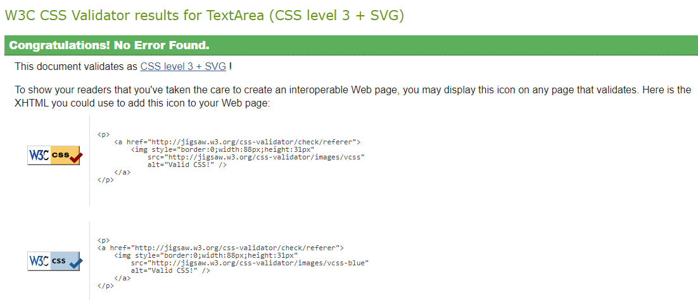

A reasonable amount of manual testing was done and results can be found below:

# Table of content

- [User story testing](#user-story-testing)
- [Functionality testing](#functionality-testing)
- [Responsiveness testing](#responsiveness-testing)
- [Browser compatibility testing](#browser-compatibility-testing)
- [HTML Validation](#html-validation)
- [CSS Validation](#css-validation)
- [Python PEP8 Validation](#python-pep8-validation)
- [JavaScript Validation](#javascript-validation-jshint)
- [Lighthouse performance audit](#lighthouse-performance-audit)
- [WAVE Accesibility testing](#wave-accesibility-testing)

# User story testing

# Functionality testing

Comprehensive testing has been conducted to ensure that all website functionalities are working as intended, providing users with a reliable and enjoyable browsing experience.

| Functionality | What's being tested | Result |
|------|-------------|--------|
| Registration | A new user can create an account successfully. | Pass |
|  | User cannot send registration form without solving captcha. | Pass |
|  | The website validates user inputs (2 password inputs match, email address is valid, name is valid). | Pass |
|  | The website displays an appropriate error message with hint when validation fails. | Pass |
|  | The website displays a message when confirmation email is sent. | Pass |
|  | The website sends user appropriate email if user try to register with existing email | Pass |
| Account Verification | A user receives a verification email after creating an account. | Pass |
|  | Verification email contains a link that, when clicked shows confirmation page with a button | Pass |
|  | The website displays an appropriate message if link is invalid or token expired | Pass |
|  | The website displays an appropriate message when a user's account is verified successfully. | Pass |
|  | User is signed in automatically when click confirm button | Pass |
|  | The website displays verify email message when a user's account is not verified. | Pass |
| Password Reset | A user receives a password reset email after requesting a password reset. | Pass |
|  | The password reset email contains a link that, when clicked, allows the user to reset their password. | Pass |
|  | The website displays an appropriate message when a user's password is reset successfully. | Pass |
|  | The website displays an appropriate message when reset link is invalid or token expired | Pass |
|  | The website validates change password form | Pass |
| SMTP Service | The SMTP service is configured correctly | Pass |
|  | Emails are sent correctly | Pass |
| Admin Panel | Admin can login to admin panel. | Pass |
|  | Admin can edit and delete posts. | Pass |
|  | Admin can change status of posts (drafts, awaiting moderation, published). | Pass |
|  | Admin can filter post view by status, author, category, created on  | Pass |
|  | Admin can use actions to change status (3 status options) of selected posts | Pass |
|  | Admin can approve or delete comments. | Pass |
|  | Admin can delete users. | Pass|
|  | Admin panel can not be accesed by regular user (unauthorized) | Pass |
| Login | A registered user can log in successfully. | Pass |
|  | The website displays an appropriate error message when a user enters an incorrect username or password. | Pass |
|  | A logged-in user can sign out successfully. | Pass |
|  | A logged-in user is asked for sign out confirmation.  | Pass |
|  | Click on confirm button sign out user.  | Pass |
| Posts CRUD | Verify that a logged-in user can create a new post. | Pass |
|  | The website displays an appropriate error message when a user enters invalid data (e.g., blank title, too long text, not allowed charset). | Pass |
|  | A user can add new post without own picture | Pass |
|  | A user can edit own post and save changes | Pass |
|  | A user cannot edit or delete another user's posts (check manual url change) | Pass |
|  | A user can delete own post | Pass |
|  | Confirmation message is displayed when changes are saved | Pass |
|  | User is asked for confirmation before deleting post | Pass |
|  | Click on delete confirmation button removes post | Pass |
|  | Confirmation message is displayed when post is deleted | Pass |
|  | The website displays posts correctly (title, excerpt, author, category, location, date, comments, likes). | Pass |
| Post pictures | A logged-in user can upload a picture to their post. | Pass |
|  | A placeholder image is diplayed if user do not upload one | Pass |
|  | The website displays pictures correctly (e.g., size, orientation, quality). | Pass |
| Comments | A logged-in user can add a comment to a post. | Pass |
|  | Anonymous userr can not post comments | Pass |
|  | The website displays all comments correctly (gravatar/placeholder, author, date, text). | Pass |
|  | The website displays the correct number of likes on main page, blog, full post, dashboard. | Pass |
| Likes | A logged-in user can like a post. | Pass |
|  | Anonymous user can not add likes to posts. | Pass |
|  | The website displays the correct number of likes for each post. | Pass |
|  | A user can only like a post once. | Pass |
|  | A user can remove previously added like | Pass |
|  | A user can not like own posts | Pass |
| Contact form | A user can send a message using contact form | Pass |
|  | A user can not send form without solving captcha | Pass |
|  | A user can not send empty form even with solved captcha | Pass |
|  | Name and email fields are prefilled for authenticated user | Pass |
|  | The website validates name, email address and message | Pass |

# Responsiveness testing

Website has been thoroughly tested for responsiveness on a wide range of devices to ensure a seamless user experience, no matter how our visitors access the site.

Following adjustments in media queries have been implemented in CSS:

- small devices up to 576px wide,
- small tablets from 576px to 768px wide,
- medium tablets/small laptops 768px to 992px,
- laptops/desktops 992px to 1200px

| Template | Apple iPad 2017 | Macbook Air 13 | Iphone X | Widescreen 27"
|--------|-----------|-----------|----------|----------|
| index.html | pass | pass | pass | pass |
| blog.html | pass | pass | pass | pass |
| about.html | pass | pass | pass | pass |
| contact.html | pass | pass | pass | pass |
| full_post.html | pass | pass | pass | pass |
| rules.html | pass | pass | pass | pass |
| user_account.html | pass | pass | pass | pass |
| add_post.html | pass | pass | pass | pass |
| edit_post.html | pass | pass | pass | pass |
| delete_post.html | pass | pass | pass | pass |
| 404.html | pass | pass | pass | pass |
| 500.html | pass | pass | pass | pass |
| email_confirm.html | pass | pass | pass | pass |
| account_inactive.html | pass | pass | pass | pass |
| email.html | pass | pass | pass | pass |
| login.html | pass | pass | pass | pass |
| logout.html | pass | pass | pass | pass |
| password_change.html | pass | pass | pass | pass |
| password_reset_done.html | pass | pass | pass | pass |
| password_reset_from_key_done.html | pass | pass | pass | pass |
| password_reset_from_key.html | pass | pass | pass | pass |
| password_reset.html | pass | pass | pass | pass |
| signup_closed.html | pass | pass | pass | pass |
| signup.html | pass | pass | pass | pass |
| verification_sent.html | pass | pass | pass | pass |
| verified_email_required.html | pass | pass | pass | pass |

# Browser compatibility testing

All templates listed in [Responsiveness testing](#responsiveness-testing) have been displayed on different browsers with various viewport size.

Following browsers were checked:

- Google Chrome,
- Safari,
- Firefox,
- Brave,
- Microsoft Edge

No errors have been found in displaying layouts, style and functionalities.

# HTML Validation

# CSS Validation

The [W3C CSS Validation Service](https://jigsaw.w3.org/css-validator/validator) has been used to validate custom CSS through direct code input, no errors found.

# Python PEP8 Validation

# JavaScript Validation

# Lighthouse performance audit

# WAVE Accesibility testing
