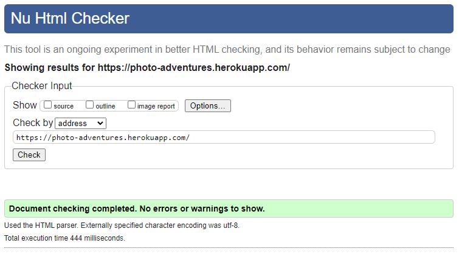

A reasonable amount of manual testing was done and results can be found below:

# Table of content

- [User story testing](#user-story-testing)
- [Functionality testing](#functionality-testing)
- [Responsiveness testing](#responsiveness-testing)
- [Browser compatibility testing](#browser-compatibility-testing)
- [HTML Validation](#html-validation)
- [CSS Validation](#css-validation)
- [Python PEP8 Validation](#python-pep8-validation)
- [JavaScript Validation](#javascript-validation)
- [Lighthouse performance audit](#lighthouse-performance-audit)
- [WAVE Accesibility testing](#wave-accesibility-testing)

# User story testing

| User story - site admin | Result |
|----------|------|
| [#2](https://github.com/alexkisielewicz/photo-adventures/issues/2) As Site Admin, I can log in to admin panel so that I can manage posts | pass |
| [#3](https://github.com/alexkisielewicz/photo-adventures/issues/3) As Site Admin, I can perform CRUD operations on posts so that I can manage the content on the blog | pass |
| [#6](https://github.com/alexkisielewicz/photo-adventures/issues/6) As Site Admin, I can view the number of likes on posts so that I can see which is the most popular | pass |
| [#7](https://github.com/alexkisielewicz/photo-adventures/issues/7) As Site Admin, I can view comments on posts so that I can read the conversation | pass |
| [#11](https://github.com/alexkisielewicz/photo-adventures/issues/11) As Site Admin, I can approve/delete users comments so that I can moderate inappropriate ones | pass |
| [#13](https://github.com/alexkisielewicz/photo-adventures/issues/13) As Site Admin, I can add posts in categories so that I can group photos by this criteria | pass |
| [#14](https://github.com/alexkisielewicz/photo-adventures/issues/14) As Site Admin, I can add tags to the posts so that others can easily find posts related to specific topics | pass |
| [#23](https://github.com/alexkisielewicz/photo-adventures/issues/23) As Site Admin, I can prevent users from liking their own posts so that posts can be liked only by other users | pass |
| [#30](https://github.com/alexkisielewicz/photo-adventures/issues/30) As Site Admin, I want to allow users to have a profile image displayed alongside their comments on the blog so it's easier for readers to identify who is commenting | pass |
| [#31](https://github.com/alexkisielewicz/photo-adventures/issues/31) As Site Admin, I want to present the users with a custom 404 page if he navigates to a page that doesn't exist so that they can see a user-friendly message that offers some guidance or suggestions | pass |
| [#33](https://github.com/alexkisielewicz/photo-adventures/issues/33) As Site Admin, I want to ensure that only human users can submit the contact form so that I can prevent spam or bot submissions | pass |
| [#38](https://github.com/alexkisielewicz/photo-adventures/issues/38) As Site Admin, I want to display success, error, and warning messages to my users using Bootstrap toasts so that they always receive easy-to-understand feedback regarding their actions | test | pass |
| [#39](https://github.com/alexkisielewicz/photo-adventures/issues/39) As Site Admin, I want to validate inputs in add/edit post forms so that I can have control on what input values are allowed | pass |
| [#40](https://github.com/alexkisielewicz/photo-adventures/issues/40) As Site Admin, I can check image dimensions, format, and file size before user upload new image so that I have full control on what files are uploaded to the cloud | not developed, moved to future enhancements board |
| [#41](https://github.com/alexkisielewicz/photo-adventures/issues/41) As Site Admin, I can distinguish specific post as featured post so that I can direct user's attention to that post | not developed, moved to future enhancements board |

| User story - site user | Result |
|----------|------|
| [#1](https://github.com/alexkisielewicz/photo-adventures/issues/1) As Site User, I can view a list of all posts so that I can select one to read | pass |
| [#4](https://github.com/alexkisielewicz/photo-adventures/issues/4) As Site User, I want to be able to create an account on the blog so that I can add posts, comments, and likes | pass |
| [#5](https://github.com/alexkisielewicz/photo-adventures/issues/5) As Site User, I can select a post so that I can read it | pass |
| [#6](https://github.com/alexkisielewicz/photo-adventures/issues/6) As Site User, I can view the number of likes on posts so that I can see which is the most popular | pass |
| [#7](https://github.com/alexkisielewicz/photo-adventures/issues/7) As Site User, I can view comments on posts so that I can read the conversation | pass |
| [#8](https://github.com/alexkisielewicz/photo-adventures/issues/8) As Site User, I can write comments on posts so that I can be the part of the conversation | pass |
| [#9](https://github.com/alexkisielewicz/photo-adventures/issues/9) As Site User, I can like/unlike posts so that I can give feedback in form of likes | pass |
| [#10](https://github.com/alexkisielewicz/photo-adventures/issues/10) As Site User, I can create draft posts so that I can finish publishing later | pass |
| [#12](https://github.com/alexkisielewicz/photo-adventures/issues/12) As Site User, I can create blog posts with photos and text so that I can share my photography adventures | pass |
| [#13](https://github.com/alexkisielewicz/photo-adventures/issues/13) As Site User, I can add posts in categories so that I can group photos by this criteria | adding category is possible but viewing posts by category is future enhancement |
| [#14](https://github.com/alexkisielewicz/photo-adventures/issues/14) As Site User, I can add tags to the posts so that others can easily find posts related to specific topics | pass |
| [#15](https://github.com/alexkisielewicz/photo-adventures/issues/15) As Site User, I can edit an delete my posts so that I can update them or remove if necessary | pass |
| [#16](https://github.com/alexkisielewicz/photo-adventures/issues/16) As Site User, I can use the contact form so that I can contact the website owner if needed | pass |
| [#17](https://github.com/alexkisielewicz/photo-adventures/issues/17) As Site User, I can view page content so that I can browse the website and interact with the content | pass |
| [#19](https://github.com/alexkisielewicz/photo-adventures/issues/19) As Site User, I can see the posts with the highest number of likes so that I know which posts are the most popular | pass |
| [#20](https://github.com/alexkisielewicz/photo-adventures/issues/20) As Site user, I can see my account page so that I can manage my posts | pass |
| [#21](https://github.com/alexkisielewicz/photo-adventures/issues/21) As Site User, I can view all posts added by me so that I can keep track of my blogging activity | pass |
| [#25](https://github.com/alexkisielewicz/photo-adventures/issues/25) As Site User, I can view my drafts in my dashboard so that I can select them and continue editing | pass |
| [#26](https://github.com/alexkisielewicz/photo-adventures/issues/26) As Site user, I can click on the edit button in full post view so that I can edit post quickly without the need of searching for the post in the dashboard | pass |
| [#29](https://github.com/alexkisielewicz/photo-adventures/issues/29) As Site User, I can get recommendations to read similar posts on the blog so that I can read stories that are in my interest range | not developed, moved to future enhancements board |
| [#35](https://github.com/alexkisielewicz/photo-adventures/issues/35) As Site User, I can view a list of all posts written in specific category so that I can read the posts from categories that I am interested in | not developed, moved to future enhancements board |
| [#37](https://github.com/alexkisielewicz/photo-adventures/issues/37) As Site User, I can share interesting posts on popular social media platforms so that my friends can learn about posts that I enjoyed reading | pass |

# Functionality testing

Comprehensive testing has been conducted to ensure that all website functionalities are working as intended, providing users with a reliable and enjoyable browsing experience.

| Functionality | What's being tested | Result |
|------|-------------|--------|
| Registration | A new user can create an account successfully. | Pass |
|  | User cannot send registration form without solving captcha. | Pass |
|  | The website validates user inputs (2 password inputs match, email address is valid, name is valid). | Pass |
|  | The website displays an appropriate error message with hint when validation fails. | Pass |
|  | The website displays a message when confirmation email is sent. | Pass |
|  | The website sends user appropriate email if user try to register with existing email | Pass |
| Account Verification | A user receives a verification email after creating an account. | Pass |
|  | Verification email contains a link that, when clicked shows confirmation page with a button | Pass |
|  | The website displays an appropriate message if link is invalid or token expired | Pass |
|  | The website displays an appropriate message when a user's account is verified successfully. | Pass |
|  | User is signed in automatically when click confirm button | Pass |
|  | The website displays verify email message when a user's account is not verified. | Pass |
| Password Reset | A user receives a password reset email after requesting a password reset. | Pass |
|  | The password reset email contains a link that, when clicked, allows the user to reset their password. | Pass |
|  | The website displays an appropriate message when a user's password is reset successfully. | Pass |
|  | The website displays an appropriate message when reset link is invalid or token expired | Pass |
|  | The website validates change password form | Pass |
| SMTP Service | The SMTP service is configured correctly | Pass |
|  | Emails are sent correctly | Pass |
| Admin Panel | Admin can login to admin panel. | Pass |
|  | Admin can edit and delete posts. | Pass |
|  | Admin can change status of posts (drafts, awaiting moderation, published). | Pass |
|  | Admin can filter post view by status, author, category, created on  | Pass |
|  | Admin can use actions to change status (3 status options) of selected posts | Pass |
|  | Admin can approve or delete comments. | Pass |
|  | Admin can delete users. | Pass|
|  | Admin panel can not be accesed by regular user (unauthorized) | Pass |
| Login | A registered user can log in successfully. | Pass |
|  | The website displays an appropriate error message when a user enters an incorrect username or password. | Pass |
|  | A logged-in user can sign out successfully. | Pass |
|  | A logged-in user is asked for sign out confirmation.  | Pass |
|  | Click on confirm button sign out user.  | Pass |
| Posts CRUD | Verify that a logged-in user can create a new post. | Pass |
|  | The website displays an appropriate error message when a user enters invalid data (e.g., blank title, too long text, not allowed charset). | Pass |
|  | A user can add new post without own picture | Pass |
|  | A user can edit own post and save changes | Pass |
|  | A user cannot edit or delete another user's posts (check manual url change) | Pass |
|  | A user can delete own post | Pass |
|  | Confirmation message is displayed when changes are saved | Pass |
|  | User is asked for confirmation before deleting post | Pass |
|  | Click on delete confirmation button removes post | Pass |
|  | Confirmation message is displayed when post is deleted | Pass |
|  | The website displays posts correctly (title, excerpt, author, category, location, date, comments, likes). | Pass |
| Post pictures | A logged-in user can upload a picture to their post. | Pass |
|  | A placeholder image is diplayed if user do not upload one | Pass |
|  | The website displays pictures correctly (e.g., size, orientation, quality). | Pass |
| Comments | A logged-in user can add a comment to a post. | Pass |
|  | Anonymous userr can not post comments | Pass |
|  | The website displays all comments correctly (gravatar/placeholder, author, date, text). | Pass |
|  | The website displays the correct number of likes on main page, blog, full post, dashboard. | Pass |
| Likes | A logged-in user can like a post. | Pass |
|  | Anonymous user can not add likes to posts. | Pass |
|  | The website displays the correct number of likes for each post. | Pass |
|  | A user can only like a post once. | Pass |
|  | A user can remove previously added like | Pass |
|  | A user can not like own posts | Pass |
| Contact form | A user can send a message using contact form | Pass |
|  | A user can not send form without solving captcha | Pass |
|  | A user can not send empty form even with solved captcha | Pass |
|  | Name and email fields are prefilled for authenticated user | Pass |
|  | The website validates name, email address and message | Pass |

# Responsiveness testing

Website has been thoroughly tested for responsiveness on a wide range of devices to ensure a seamless user experience, no matter how our visitors access the site.

Following adjustments in media queries have been implemented in CSS:

- small devices up to 576px wide,
- small tablets from 576px to 768px wide,
- medium tablets/small laptops 768px to 992px,
- laptops/desktops 992px to 1200px

| Template | Apple iPad 2017 | Macbook Air 13 | Iphone X | Widescreen 27"
|--------|-----------|-----------|----------|----------|
| index.html | pass | pass | pass | pass |
| blog.html | pass | pass | pass | pass |
| about.html | pass | pass | pass | pass |
| contact.html | pass | pass | pass | pass |
| full_post.html | pass | pass | pass | pass |
| rules.html | pass | pass | pass | pass |
| user_account.html | pass | pass | pass | pass |
| add_post.html | pass | pass | pass | pass |
| edit_post.html | pass | pass | pass | pass |
| delete_post.html | pass | pass | pass | pass |
| 404.html | pass | pass | pass | pass |
| 500.html | pass | pass | pass | pass |
| email_confirm.html | pass | pass | pass | pass |
| account_inactive.html | pass | pass | pass | pass |
| email.html | pass | pass | pass | pass |
| login.html | pass | pass | pass | pass |
| logout.html | pass | pass | pass | pass |
| password_change.html | pass | pass | pass | pass |
| password_reset_done.html | pass | pass | pass | pass |
| password_reset_from_key_done.html | pass | pass | pass | pass |
| password_reset_from_key.html | pass | pass | pass | pass |
| password_reset.html | pass | pass | pass | pass |
| signup.html | pass | pass | pass | pass |
| verification_sent.html | pass | pass | pass | pass |
| verified_email_required.html | pass | pass | pass | pass |

# Browser compatibility testing

All templates listed in [Responsiveness testing](#responsiveness-testing) have been displayed on different browsers with various viewport size.

Following browsers were checked:

- Google Chrome,
- Safari,
- Firefox,
- Brave,
- Microsoft Edge

No errors have been found in displaying layouts, style and functionalities.

# HTML Validation

The [W3C Markup Validation Service](https://validator.w3.org/) has been used to validate html files, also W3C Web Validator VSC extension was used throughtout development to mark and elimanate errors. For pages that require authentication I used "validate by direct input" method with source code.

| Template | Validation Result |  Final validation
|--------|-----------|---------|
| index.html | p nested inside ul, gravatar without alt tag | pass
| blog.html | missing picture alt tags | pass |
| about.html | no errors | pass
| contact.html | no errors | pass
| full_post.html | summernote widget has errors | pass/third party code errors
| rules.html | no errors | pass
| user_account.html | gravatar img doesn't have alt tag | pass |
| add_post.html | summernote widget has errors | pass/third party code errors |
| edit_post.html | summernote widget has errors | pass/third party code errors |
| delete_post.html | a nested inside button | pass
| 404.html | no errors | pass |
| 500.html | no errors | pass |
| email_confirm.html | no errors | pass |
| account_inactive.html | no errors |pass |
| email.html | no errors | pass |
| logout.html | no errors | pass |
| password_change.html | no errors | pass |
| password_reset_done.html | no errors | pass |
| password_reset_from_key_done.html | no errors |pass |
| password_reset_from_key.html | no errors | pass |
| password_reset.html | no errors |pass |
| signup.html | no errors | pass
| verification_sent.html | no errors | pass |
| verified_email_required.html | no errors | pass |

# CSS Validation

The [W3C CSS Validation Service](https://jigsaw.w3.org/css-validator/validator) has been used to validate custom CSS through direct code input, no errors found.

# Python PEP8 Validation

[CI Python Linter](https://pep8ci.herokuapp.com/) was used for PEP8 validation, also IDE extension was used throughout development to spot errors.

| File | Validation Result |
|--------|-----------|
| manage.py | pass |
| photoadventures/settings.py | breaking long lines in AUTH_PASSWORD_VALIDATORS results in django error, code was left unedited for this reason, it is django default code |
| photoadventures/urls.py | pass |
| photoadventures/manage.py | pass |
| blog/views.py | pass |
| blog/urls.py | pass |
| blog/models.py | pass |
| blog/constants.py | pass |
| blog/apps.py | pass |
| blog/admin.py | pass |
| blog/templatetags/gravatar.py | pass |

# JavaScript Validation

JavaScript files were validated using online service [jshint.com](https://jshint.com/).
The common finding was missing semicolon at the end of the line, they were all added to clear warnings.

| File | Screenshot |
|------|------------|
| send_email.js|  |
| email_init.js|  |
| script.js|  |
| signup_captcha.js|  |
| validate_form.js|  |

# Lighthouse performance audit

# WAVE Accesibility testing
